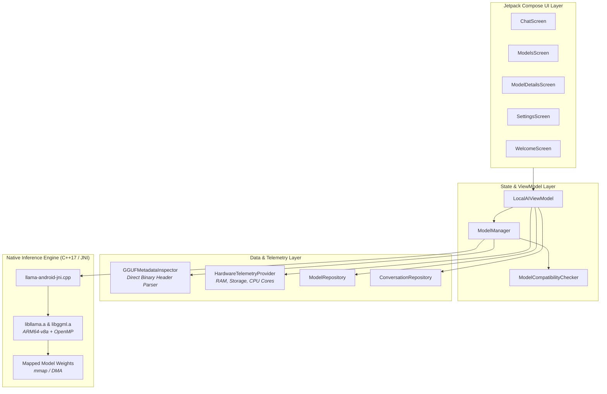

# Local AI — On-Device LLM Runner for Android

<div align="center">

[-3DDC84?logo=android&logoColor=white)](#prerequisites)
[](#hardware-requirements)
[](https://kotlinlang.org)
[](https://developer.android.com/jetpack/compose)
[](https://github.com/ggerganov/llama.cpp)
[](#privacy-guarantee)

**Run modern Large Language Models completely offline, directly on your Android hardware.**  
*Zero cloud dependencies · Zero telemetry · 100% private.*

</div>

---

## 📖 Overview

**Local AI** is a native Android application designed to execute state-of-the-art quantized GGUF language models directly on-device. Powered by a high-performance native `llama.cpp` C++ engine compiled for 64-bit ARM architectures (`arm64-v8a`), Local AI delivers streaming on-device conversational intelligence without requiring internet access, remote API keys, or cloud servers.

All neural network weights are mapped into volatile device RAM using `mmap`, ensuring rapid loading and private computation that never leaves your device.

---

## ✨ Features

- 🔒 **100% Offline & Private by Design**: No telemetry, no external data egress, and no network calls during inference.
- ⚡ **Native C++ Performance**: Direct JNI bridge to `llama.cpp` and `ggml` with OpenMP multithreading optimizations for ARM NEON.
- 📦 **Universal GGUF Compatibility**: Built-in binary header inspector reads GGUF metadata (architecture, quantization, context length, parameters) directly from device storage.
- 🧠 **Wide Model Support**: Compatible with architectures including:
  - **Llama 3 / 3.1 / 3.2 / 3.3**
  - **Qwen 2.5 / Qwen 2.5 Coder**
  - **Gemma / Gemma 2**
  - **Phi 3 / 3.5 / 4**
  - **Mistral / Mistral NeMo**
  - **DeepSeek / SmolLM / StarCoder**
- 🖼️ **Multimodal Ready**: Support for linking auxiliary Vision projectors (`.mmproj` / CLIP) for multimodal workflows.
- 📊 **Real-time Hardware Telemetry**: Live monitoring of unified RAM utilization (Used / Free GB), storage footprint, CPU core scaling, and dynamic generation metrics (tokens/second, token count).
- 🎨 **Modern Jetpack Compose UI**: Built with Material 3 design, edge-to-edge transparent system bars, smooth fluid transitions, and complete IME keyboard avoidance.
- 🎛️ **Granular Inference Controls**: Tune CPU thread count, context window size (e.g. 2048 – 8192+), and sampling temperature on the fly.
- 📂 **Storage Access Framework (SAF)**: Import any `.gguf` weight file directly from local storage, Downloads, or an external SD card.

---

## 🏛️ Architecture



---

## 📱 System Requirements

### Hardware
| Component | Minimum | Recommended |
|---|---|---|
| **CPU Architecture** | 64-bit ARM (`arm64-v8a`) | 64-bit ARM with ARMv8.2-A+ DotProd / FP16 |
| **Unified RAM** | 4 GB (for models $\le$ 1.5B) | 8 GB – 12 GB+ (for 3B – 7B models) |
| **Storage** | 3 GB free storage | 10 GB+ high-speed internal flash (UFS 3.1 / 4.0) |

### Software
- **Android OS**: Android 7.0 (API Level 24) or newer.
- **Target SDK**: Android 16 (API Level 36).

---

## 🚀 Recommended Models

Any GGUF model with quantization compatible with llama.cpp can be run. Recommended starting models from Hugging Face:

| Model Architecture | Recommended Quantization | Model File Size | Recommended Device RAM | Use Case |
|---|---|---|---|---|
| **SmolLM2-360M-Instruct** | `Q4_K_M` or `Q8_0` | ~250 MB | 4 GB | Ultra-lightweight, rapid testing |
| **Qwen2.5-0.5B-Instruct** | `Q4_K_M` | ~390 MB | 4 GB | Super-fast responses, basic QA |
| **Llama-3.2-1B-Instruct** | `Q4_K_M` | ~800 MB | 4 GB – 6 GB | Balanced mobile general assistant |
| **Qwen2.5-1.5B-Instruct** | `Q4_K_M` | ~1.1 GB | 6 GB | Excellent reasoning & concise output |
| **Qwen2.5-Coder-1.5B** | `Q4_K_M` | ~1.1 GB | 6 GB | On-device coding and syntax parsing |
| **Llama-3.2-3B-Instruct** | `Q4_K_M` | ~2.0 GB | 8 GB | High conversational fidelity |
| **Gemma-2-2B-IT** | `Q4_K_M` | ~1.6 GB | 6 GB – 8 GB | Strong multilingual & factual accuracy |
| **Qwen2.5-7B-Instruct** | `Q4_K_M` | ~4.7 GB | 12 GB+ | Deep reasoning on flagship devices |

> [!TIP]
> Download models in `.gguf` format directly from [Hugging Face](https://huggingface.co/models?search=gguf) (e.g. `bartowski`, `Qwen`, or `unsloth` repositories).

---

## 🛠️ Building & Installation

### Prerequisites

- **[Android Studio](https://developer.android.com/studio)** (Ladybug 2024.2.1+ or newer)
- **Android SDK & NDK**:
  - SDK Platforms: API 36 / 35 / 34
  - CMake: `3.22.1`
  - NDK: Side-by-side NDK (recommended version `26.x` or `27.x`)
- **Java Development Kit**: JDK 17 or JDK 21

### 1. Clone the Repository

```bash
git clone https://github.com/<your-username>/llm_runner.git
cd llm_runner
```

### 2. Configure Environment

Copy `.env.example` to `.env`:

```bash
cp .env.example .env
```

### 3. Build & Install via CLI

Ensure your Android device has **USB Debugging** enabled and is connected:

```bash
# Verify device connection
adb devices

# Compile and install debug APK directly
./gradlew installDebug
```

Alternatively, to build the debug APK without installing:

```bash
./gradlew assembleDebug
# Generated APK location:
# app/build/outputs/apk/debug/app-debug.apk
```

To install the built APK manually:

```bash
adb install -r app/build/outputs/apk/debug/app-debug.apk
```

---

## 📥 Loading Models onto Your Device

You have two convenient ways to load `.gguf` models into the app:

### Method A: Direct In-App Import (SAF)
1. Download any `.gguf` model file on your phone (using a browser or Google Drive).
2. Open **Local AI**.
3. Navigate to the **Models** tab (or the Welcome screen).
4. Tap **"Import GGUF"** and select the `.gguf` file using Android's system document picker.
5. The app inspects the header, computes compatibility, and allows you to load the model into RAM.

### Method B: Fast Push via ADB

For large models (2GB+), pushing directly via ADB is much faster:

```bash
# Push model directly to your device's Download folder
adb push my-model-Q4_K_M.gguf /sdcard/Download/
```

Then tap **"Import GGUF"** in Local AI and select the file from your Downloads folder.

---

## 📂 Project Structure

```
llm_runner/
├── app/
│   ├── src/
│   │   ├── main/
│   │   │   ├── cpp/                       # Native C++ llama.cpp inference engine
│   │   │   │   ├── CMakeLists.txt         # NDK build script
│   │   │   │   ├── llama-android-jni.cpp  # JNI bindings and token streaming
│   │   │   │   ├── include/               # llama.h, ggml.h, etc.
│   │   │   │   └── lib/arm64-v8a/         # Precompiled static libraries (libllama.a, libggml.a)
│   │   │   ├── java/com/example/
│   │   │   │   ├── MainActivity.kt        # App entry point & top-level navigation
│   │   │   │   ├── backend/               # Inference backend abstractions
│   │   │   │   │   └── llama/             # LlamaCppBackend & JNI bridge (LlamaCppNative)
│   │   │   │   ├── data/
│   │   │   │   │   ├── hardware/          # HardwareTelemetryProvider (RAM, Storage, CPU)
│   │   │   │   │   ├── local/             # GGUFMetadataInspector (binary parser), FilePickerManager
│   │   │   │   │   ├── model/             # ModelMetadata, ChatMessage, AppSettings
│   │   │   │   │   └── repository/        # ModelRepository, ConversationRepository, SettingsRepository
│   │   │   │   ├── domain/                # ModelManager, ModelCompatibilityChecker
│   │   │   │   ├── engine/                # LocalLLMEngine & GenerationChunk
│   │   │   │   └── ui/
│   │   │   │       ├── components/        # Header, BottomNavBar, EmblemIcon
│   │   │   │       ├── screens/
│   │   │   │       │   ├── chat/          # ChatScreen & conversational streaming UI
│   │   │   │       │   ├── models/        # ModelsScreen & ModelDetailsScreen
│   │   │   │       │   ├── settings/      # SettingsScreen & telemetry diagnostic view
│   │   │   │       │   ├── setup/         # ModelSetupFlowScreen (mmap loading progress)
│   │   │   │       │   └── welcome/       # WelcomeScreen onboarding
│   │   │   │       ├── theme/             # Color tokens, Typography, Material3 theme
│   │   │   │       └── viewmodel/         # LocalAIViewModel
│   │   │   └── res/                       # Drawables, layouts, fonts, themes
│   │   └── test/                          # Unit and instrumentation tests
│   └── build.gradle.kts                   # Application Gradle build configuration
├── gradle/                                # Gradle wrapper configuration
├── build.gradle.kts                       # Root Gradle configuration
└── README.md                              # Project documentation
```

---

## ⚡ Performance Optimization Tips

- **Quantization**: Always prefer `Q4_K_M` for mobile. It provides the best quality-to-RAM balance.
- **Context Length**: Each 1,024 context tokens consumes additional KV-cache RAM. On devices with $\le$ 6 GB RAM, set the context length to `2048` in the Settings tab.
- **Thread Count**: By default, the engine configures inference threads based on available performance cores (typically 4–6 threads). Avoid setting threads higher than physical CPU cores to prevent thermal throttling.
- **RAM Overhead**: Android's LMK (Low Memory Killer) may terminate background apps if memory is tight. The app includes active telemetry indicators to warn you if a model exceeds available free memory.

---

## 🛡️ Privacy Guarantee

> **"Your sanctuary remains sealed."**
> 
> Local AI does not connect to any inference server. Weights are read from local storage and initialized strictly in volatile on-device RAM. No chat transcripts, prompts, or telemetry metrics ever leave your phone.

---

## 🤝 Contributing

Contributions are welcome! Please feel free to open issues or submit pull requests for:
- Additional backend support (e.g. Vulkan / GPU acceleration via GGML Vulkan backend)
- Enhanced prompt formatting templates (ChatML, Llama-3, Gemma-IT)
- Performance benchmarks across various Snapdragon / Dimensity chipsets

---

## 📄 License

This project is licensed under the Apache License 2.0. The native inference engine is built upon [llama.cpp](https://github.com/ggerganov/llama.cpp), licensed under the MIT License.
